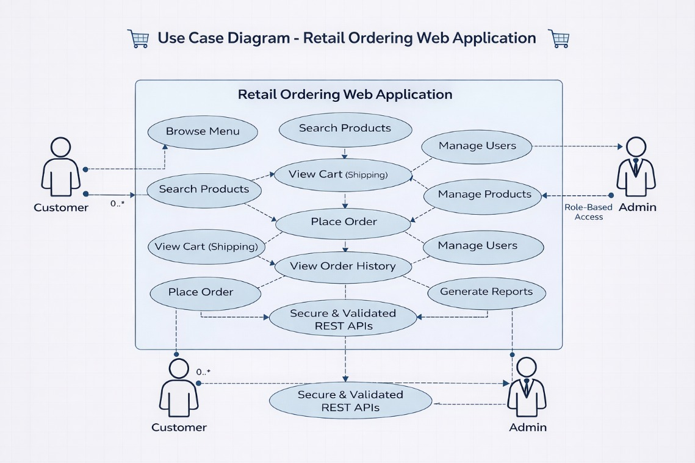

# 🍕 HCL Hackathon – Retail Ordering Platform

<p align="center">
  <b>Full-Stack Java Retail Ordering Web Application</b><br>
  Secure • Scalable • Production-Ready Architecture
</p>

---

## 🚀 Overview

A scalable and secure **Retail Ordering Web Application** that enables customers to:

- 🛍️ Browse Pizza, Cold Drinks & Breads
- 🛒 Add items to cart
- 📦 Place orders seamlessly
- 🔄 Auto-update inventory
- 🔐 Access secure REST APIs

Built with clean layered architecture and production-ready backend design.

---

## 🧠 Problem Statement

Build a centralized retail ordering platform that:

✔ Allows customers to browse & order items smoothly  
✔ Maintains secure & efficient backend operations  
✔ Automatically updates inventory  
✔ Provides scalable REST APIs  

---

## 🏗️ Tech Stack

### 🔹 Frontend

| Technology | Purpose |
|------------|----------|
| React.js | UI Library |
| Vite | Build Tool |
| HTML5 | Structure |
| CSS3 / Tailwind | Styling |
| Axios | API Calls |
| React Router | Navigation |

### 🔹 Backend
| Technology | Purpose |
|------------|----------|
| Java | Core language |
| Spring Boot | Backend framework |
| Spring Security | Authentication & Authorization |
| JPA / Hibernate | ORM |
| MySQL | Database |
| REST APIs | Communication layer |

### 🔹 Testing

| Tool | Purpose |
|------|----------|
| Postman | API testing |
| Swagger UI | API documentation & validation |

### 🔹 Integration

| Tool | Purpose |
|------|----------|
| Git | Version control |
| GitHub | Repository hosting |
| Maven | Dependency management & build |
| REST APIs | Frontend ↔ Backend communication |
| CORS Configuration | Cross-origin handling |

### 🔹 Tools
- Postman (API Testing)
- Swagger (API Documentation)
- Git & GitHub (Version Control)

---

## 🎯 Core Features

### 🛍️ 1. Centralized Portal
- Brands management
- Categories management
- Packaging options
- Product listings

### 🛒 2. Cart & Order Management
- Add / Remove items
- Quantity updates
- Order placement
- Order confirmation

### 📦 3. Automatic Inventory System
- Stock deduction on confirmed order
- Prevent out-of-stock ordering

### 🔐 4. Secure APIs
- JWT Authentication
- Role-based authorization (Admin / Customer)
- Rate limiting
- Protected endpoints

### 🔎 5. REST API Validation
- Swagger UI integration
- Postman tested endpoints

---

## 🌟 Stretch Features

- 📜 Order history

---

## 🏛️ Project Architecture
Client (Web/App) -> Controller Layer -> Service Layer -> Repository Layer -> Database

---

## 🧩 Use Case Diagram

<p align="center">
  
</p>

This diagram illustrates:
- Customer interactions (Browse, Search, Cart, Order)
- Admin role-based access
- Secure & validated REST API communication
- Backend control flow


Clean separation of concerns following layered architecture.

---

## 🗄️ Database Entities

- User
- Role
- Product
- Category
- Cart
- Order
- OrderItem

---

## 🔐 Security Flow

1. User registers / logs in  
2. JWT token generated  
3. Token required for protected endpoints  
4. Role-based access control applied  

---

## 📌 Sample API Endpoints

| Method | Endpoint | Description |
|--------|----------|------------|
| POST | `/api/auth/register` | Register user |
| POST | `/api/auth/login` | Login user |
| GET | `/api/products` | Fetch products |
| POST | `/api/cart/add` | Add to cart |
| POST | `/api/orders/place` | Place order |

---

## ⚙️ Setup Instructions

### 1️⃣ Clone Repository

```bash
git clone https://github.com/your-username/hcl-hackathon-team-codex.git
cd hcl-hackathon-team-codex
```

### 2️⃣ Configure Database

Update application.properties:

```bash
    spring.datasource.url=jdbc:mysql://localhost:3306/retail_db
    spring.datasource.username=root
    spring.datasource.password=yourpassword
```

### 3️⃣ Run Application

```bash
    mvn spring-boot:run
```

Application runs at:

```bash
    http://localhost:8080
```

---


### 📈 Future Enhancements

    💳 Payment Gateway Integration

    📍 Real-time order tracking

    📊 Admin analytics dashboard

    🐳 Docker deployment

    ☁️ Cloud hosting (AWS/Azure)

### 👨‍💻 Team

    Team Codex
    HCL Hackathon 2026

### 🏁 Conclusion

This project demonstrates:

    Secure backend development

    Clean architecture design

    Inventory automation

    RESTful best practices

    Production-ready structure

---

⭐ If you like this project, give it a star!